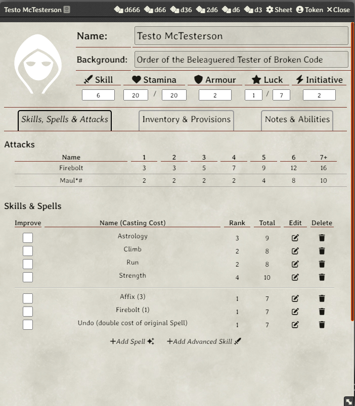
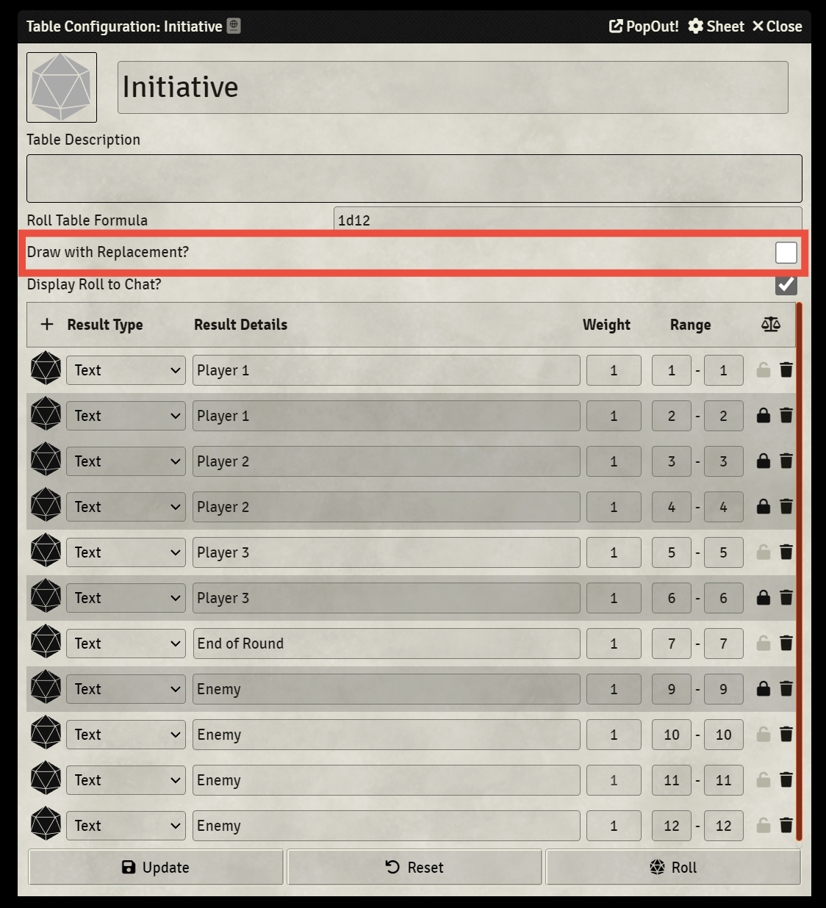
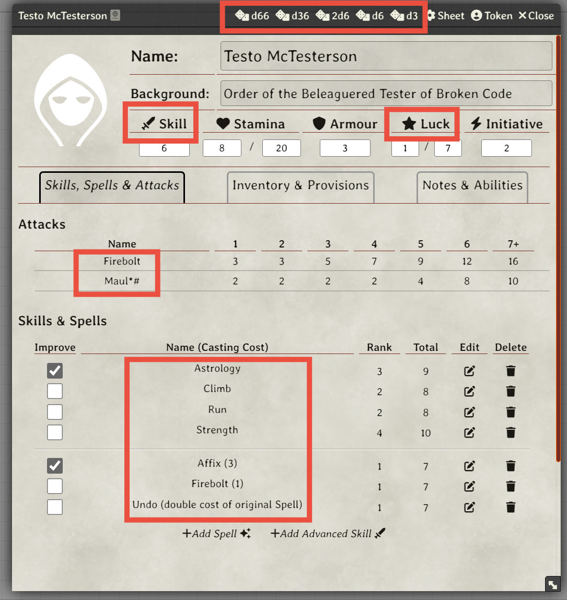
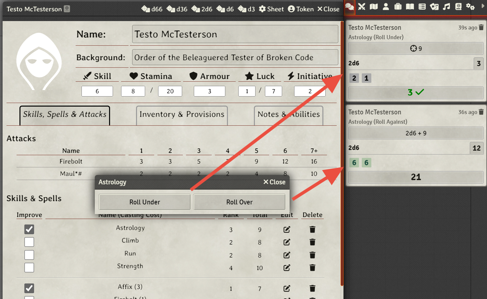
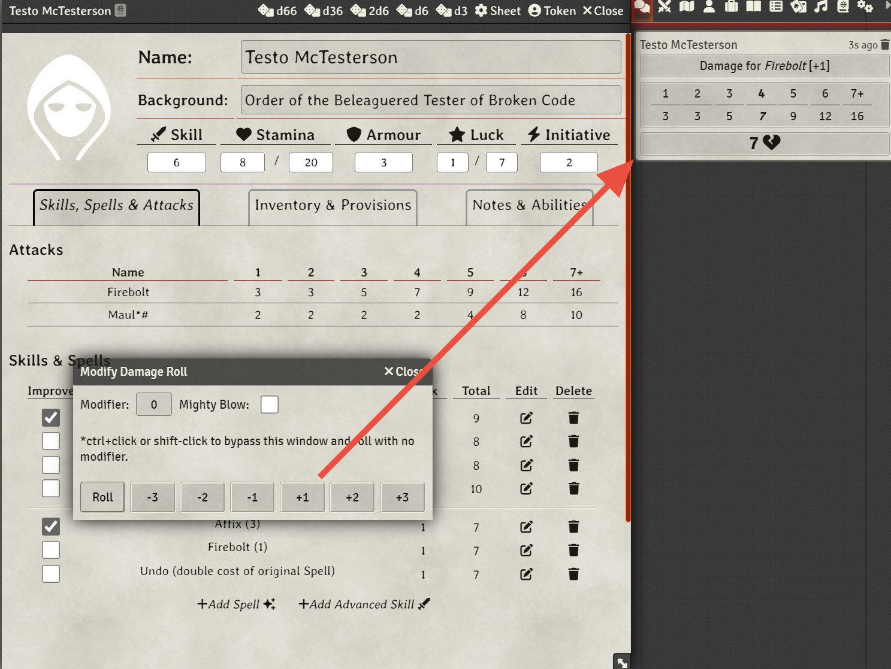
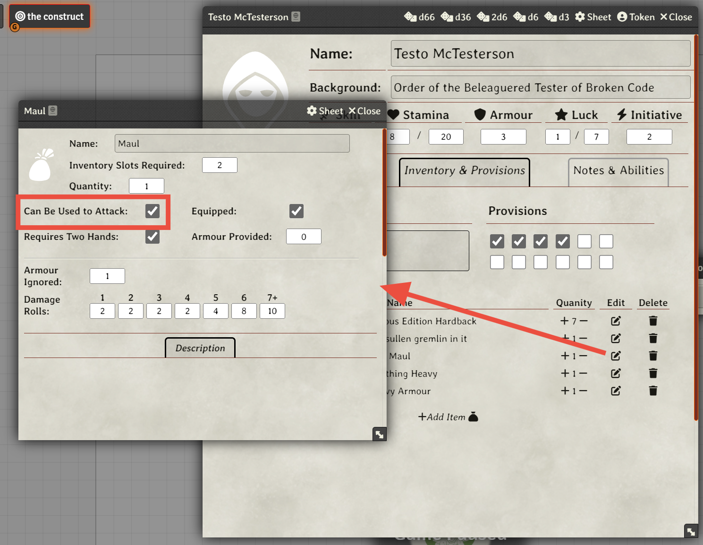
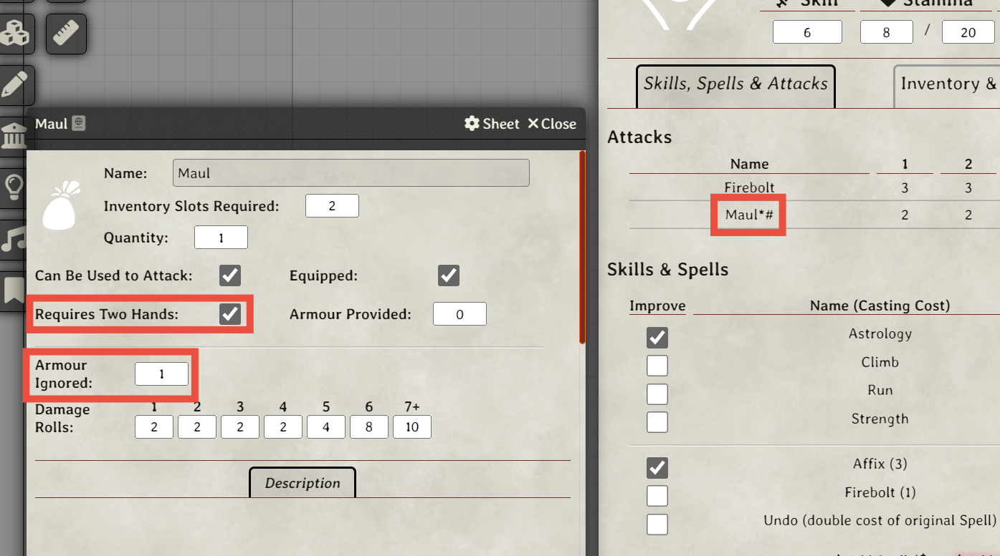
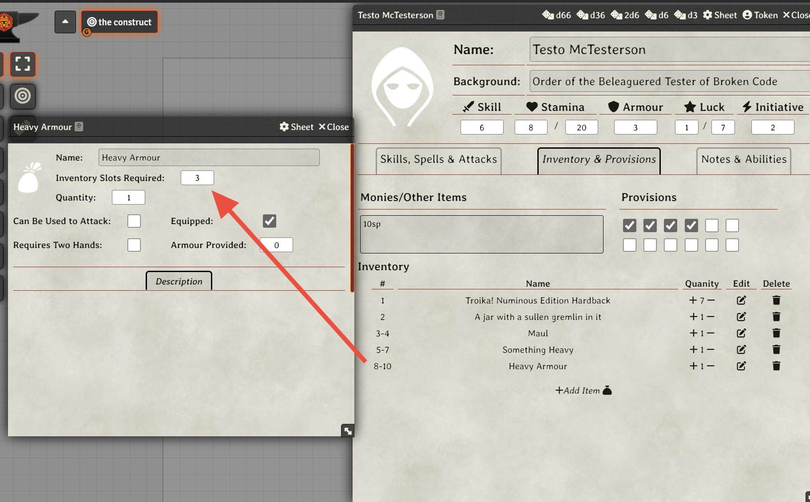
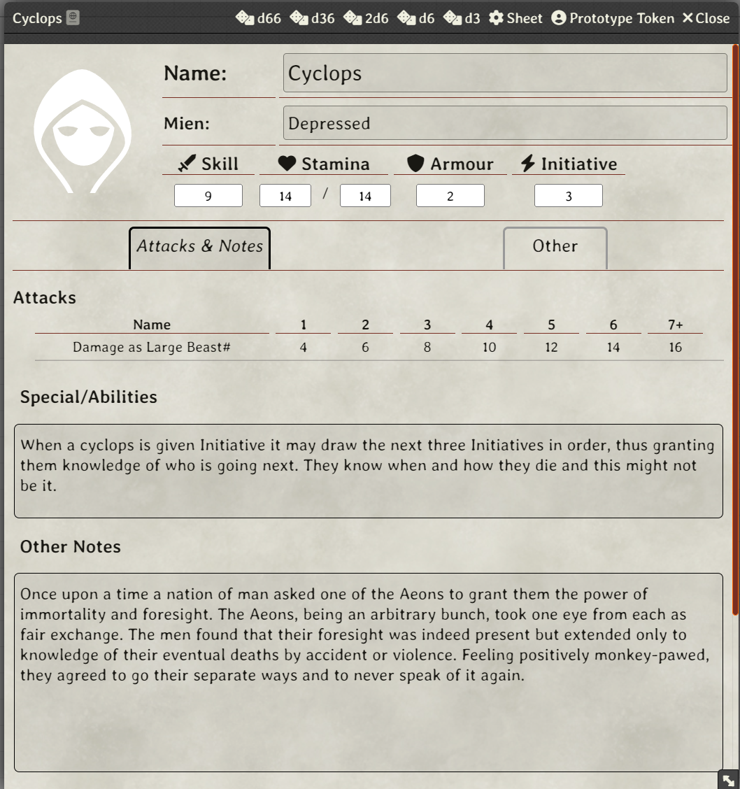

<h1>Hod Studio Publishing, in collaboration with <a href="http://www.melsonia.com/" target="_blank" rel="nofollow noopener">Melsonian Arts Council</a>, proudly presents:</h1>

<em>The official Troika! system for Foundry Virtual Tabletop</em>

&nbsp;

This system started as a fan-made (amazing work @TheLastScrub, you will never be forgotten!), but is now on the Hod Studio Publishing/Cussa Mitre hands!

&nbsp;

There are several improvements we are planning to do on the system. To know more, check the open issues and discussions happening around the game.

## System Features

* PC Sheet
  * Roll Skill and Luck
  * Roll Advanced Skills and Spells
  * Drag inventory around to re-order
* NPC Sheet
  * Roll Skill
  * Set current mien, log 6 possible miens
* Compendiums
  * All SRD Spells and Skills
  * All SRD Items
  * SRD Oops! Magic Fumble Table

## Character Sheet

## Initiative

Initiative in Troika is difficult to implement with the standard Foundry VTT initiative tracker. But one way of doing within Foundry is to use a *Roll Table*. To do so, add two values for each PC, one value for the end of round, and however many rows are necessary for NPCs. 

Then, make sure that *Draw With Replacement* is **unchecked**, such that values that have already been drawn are removed from the available pool. If the end of round option comes up, simply hit the 'reset' button to bring back the disabled options. Rebalance the table as combatants are killed or defeated.

## Rolling Dice

The following fields on a character sheet are rollable:

Skill tests let the user choose to roll under (in which case the system rolls 2d6 under the target), or over in which case the system rolls 2d6+Skill.

NOTE - Hold shift and click to bypass the dialog and roll under, hold control and click to bypass the dialog and roll over.

When rolling damage, a dialoge will appear that allows the user to modify the 1d6 roll. A custom modifier can be typed in (to account for armor for instance). Or there are buttons that roll with a modifier of -3 through +3 as well. 

All the damage values are displayed in the chat for reference, the value that was rolled is bolded.

Note - *Armour Ignored* value is not automatically included in the damage calculation.

## Configuring Attacks

The attacks grid is populated based on what spells and items a character has (this is true of NPCs as well). In order to show up in the available attacks grid, an item or spell must be edited and marked as being an attack:

If the *Requires Two Hands* checkbox is checked, an asterisk is placed next to the name of the attack in the grid. Similarly, if a non-zero value for *Armour Ignored* is entered, a # sign is placed next to the attack name.

## Inventory Management

Items in the inventory section can be dragged to re-order. Items in compendiums can be dragged and dropped directly on the sheet to add them. If an item is marked as needing multiple inventory slots (heavy armour for instance), it will note the slots it takes up as a range.

## NPC Sheet

Most characters can be represented by the default PC sheet. To facilitate this, *Initiative* is a value even on a PC sheet.

However besides the *PC*, there are two other Actor types included in the system. These are the *NPC* and the *NPC-Complex*. The complex NPC is simply the PC sheet, but the *Background* field has been replaced by *Mien*. This is largely for more complicated NPCs that might have spells or otherwise be like a PC.

The standard NPC sheet is meant to represent a character statblock similar to the bestiary in the core rulebook. It is far more simple than the PC sheet:

## Credits

Original system and all versions prior to 1.2 created by TheLastScrub

Version 1.2 and ahead created by Cussa Mitre/Hod Studio Publishing